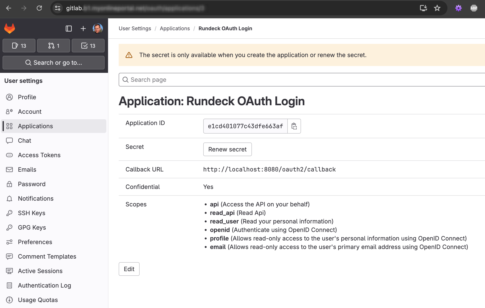
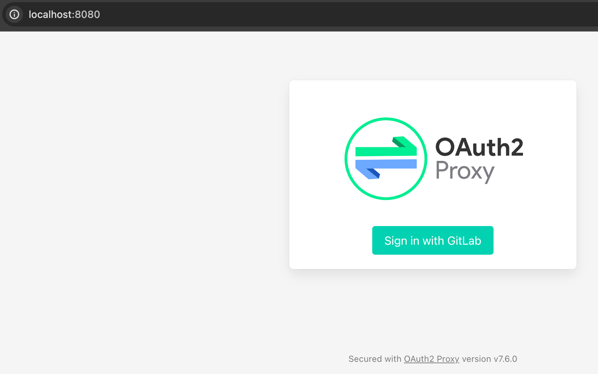
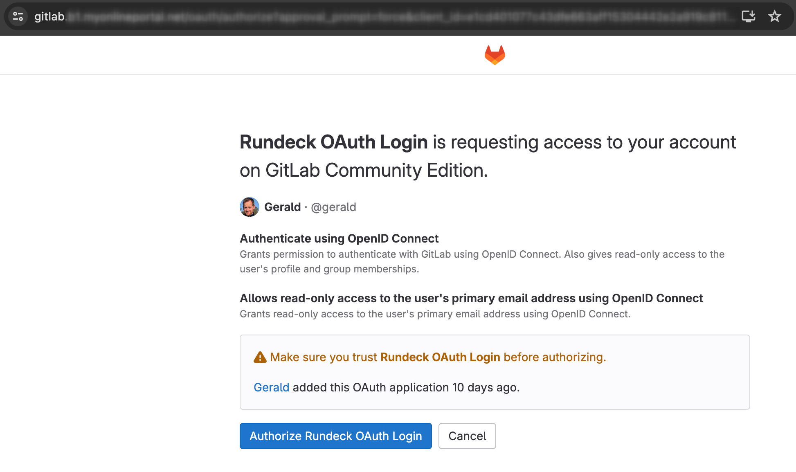

# rundeck-oauth
Provide a Rundeck CE container which allows authentication with OAuth.
This will use the open source Rundeck CE with [OAuth-Proxy](https://github.com/oauth2-proxy/oauth2-proxy) and NGinx to
make OIDC, OAuth with Rundeck possible.

## Build Locally

```sh
    docker build -t rundeck-oauth rundeck/.
```

## Test Locally

Start minimal

```sh
    docker run --rm --name rundeck-oauth -p 4440:4440 -e RUNDECK_GRAILS_URL=http://localhost:4440 rundeck-oauth
```

Get into the container

```sh
    docker exec -it rundeck-outh bash
```

## Preauthenticated Mode

```sh
    docker pull ghcr.io/geraldhansen/rundeck-oauth:latest  
    docker run -it --rm --name rundeck-oauth -p 8080:80
    -e RUNDECK_GRAILS_URL=http://localhost:8080
    -e RUNDECK_PREAUTH_ENABLED=true
    -e RUNDECK_OAUTH_CLIENT_ID="xxxxxx"
    -e RUNDECK_OAUTH_CLIENT_SECRET="gloas-xxxx"
    -e RUNDECK_OAUTH_COOKIE_SECRET="xxxx"
    -e RUNDECK_OAUTH_OIDC_URL="<url OIDC provider url>"
    -e RUNDECK_OAUTH_ADMIN_GROUP="<your group which will be the admin>"
    ghcr.io/geraldhansen/rundeck-oauth
```

## Examples
### OAuth with GitLab

1. [Create a user-owned, group-owned or instance-wide application](https://docs.gitlab.com/ee/integration/oauth_provider.html)  
     
   You need to save the Application ID (use as RUNDECK_OAUTH_CLIENT_ID) and the Secret (use as RUNDECK_OAUTH_CLIENT_SECRET). The Callback URL should be the same as your RUNDECK_GRAILS_URL plus "/oauth2/callback". The Callback URL can be changed at any time and only for local testing it should be set to localhost.  
   Following Scopes need to be set:
   * api (Access the API on your behalf)
   * read_api (Read Api)
   * read_user (Read your personal information)
   * openid (Authenticate using OpenID Connect)
   * profile (Allows read-only access to the user's personal information using OpenID Connect)
   * email (Allows read-only access to the user's primary email address using OpenID Connect)  
1. The RUNDECK_OAUTH_COOKIE_SECRET can be self created by using  
   ```sh
   python -c 'import os,base64; print(base64.urlsafe_b64encode(os.urandom(32)).decode())'
   ```
   as described in the [OAuth2-Proxy documentation](https://oauth2-proxy.github.io/oauth2-proxy/configuration/overview/#generating-a-cookie-secret)
   which is used to secure your cookies.
1. The RUNDECK_OAUTH_OIDC_URL is your GitLab url with protocol https://gitlab.my-organisation.com for example
1. As RUNDECK_OAUTH_ADMIN_GROUP you need to use a group from GitLab where your user is a member. Otherwise only the admin group will have admin priviledges and you can't do anything in Rundeck because your user is not part of this group.
1. Now start the container with  
   ```sh
   docker run -it --rm --name rundeck-oauth -p 8080:80 \  
   -e RUNDECK_GRAILS_URL=http://localhost:8080 \  
   -e RUNDECK_PREAUTH_ENABLED=true \  
   -e RUNDECK_OAUTH_CLIENT_ID="xxxxxx" \  
   -e RUNDECK_OAUTH_CLIENT_SECRET="gloas-xxxxxx" \  
   -e RUNDECK_OAUTH_COOKIE_SECRET="xxxxx" \  
   -e RUNDECK_OAUTH_OIDC_URL="https://gitlab.my-organisation.com" \  
   -e RUNDECK_OAUTH_ADMIN_GROUP="rundeck" \  
   ghcr.io/geraldhansen/rundeck-oauth
   ```
1. If you open your browser now on [http://localhost:8080](http://localhost:8080) you should see the GitLab login option  
     
   There you need to authorize your local Rundeck  
     
   Finally you should see your Rundeck Web Interface


## Troubleshooting
* Rundeck issues are logged to stdout of the container and visible with "docker logs" command
* Nginx is logging to _/var/log/nginx/access.log_ and _/var/log/nginx/error.log_ inside of the running container
* OAuth2-Proxy is logging to _/var/log/oauth2-proxy.log_ inside of the running container

